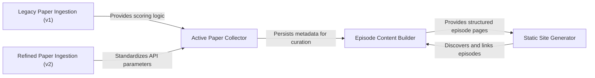

## Details

The weekly_paper_digest system is an automated pipeline designed to curate academic research from bioRxiv and PubMed into a structured digital publication. The process begins with automated paper collection and scoring based on journal prestige and keyword relevance. Once papers are filtered and deduplicated, the system uses LLM-driven logic to synthesize content into episodes and editorial notes. Finally, a static site generation layer transforms these markdown-based insights into a web-ready frontend, complete with analytics and historical archives.

### Legacy Paper Ingestion (v1)
Provides the initial implementation of the paper collection pipeline, focusing on basic fetching from bioRxiv and PubMed with early scoring logic.

**Related Classes/Methods**:

- `scripts.archive.20260602_paper_collector_ver1.fetch_pubmed_ids`:258-272
- `scripts.archive.20260602_paper_collector_ver1.fetch_biorxiv`:384-453
- `scripts.archive.20260602_paper_collector_ver1.build_score`:216-228
- `scripts.archive.20260602_paper_collector_ver1.Paper`:123-134

**Source Files:**

- [`scripts/archive/20260602_paper_collector_ver1.py`](https://github.com/kuroppy/weekly_paper_digest/blob/main/.codeboardingscripts/archive/20260602_paper_collector_ver1.py)
  - `scripts.archive.20260602_paper_collector_ver1.Paper` ([L123-L134](https://github.com/kuroppy/weekly_paper_digest/blob/main/.codeboardingscripts/archive/20260602_paper_collector_ver1.py#L123-L134)) - Class
  - `scripts.archive.20260602_paper_collector_ver1.normalize_text` ([L141-L144](https://github.com/kuroppy/weekly_paper_digest/blob/main/.codeboardingscripts/archive/20260602_paper_collector_ver1.py#L141-L144)) - Function
  - `scripts.archive.20260602_paper_collector_ver1.normalize_doi` ([L146-L152](https://github.com/kuroppy/weekly_paper_digest/blob/main/.codeboardingscripts/archive/20260602_paper_collector_ver1.py#L146-L152)) - Function
  - `scripts.archive.20260602_paper_collector_ver1.parse_pub_date` ([L154-L184](https://github.com/kuroppy/weekly_paper_digest/blob/main/.codeboardingscripts/archive/20260602_paper_collector_ver1.py#L154-L184)) - Function
  - `scripts.archive.20260602_paper_collector_ver1.days_since` ([L186-L191](https://github.com/kuroppy/weekly_paper_digest/blob/main/.codeboardingscripts/archive/20260602_paper_collector_ver1.py#L186-L191)) - Function
  - `scripts.archive.20260602_paper_collector_ver1.keyword_score` ([L193-L203](https://github.com/kuroppy/weekly_paper_digest/blob/main/.codeboardingscripts/archive/20260602_paper_collector_ver1.py#L193-L203)) - Function
  - `scripts.archive.20260602_paper_collector_ver1.journal_score` ([L205-L214](https://github.com/kuroppy/weekly_paper_digest/blob/main/.codeboardingscripts/archive/20260602_paper_collector_ver1.py#L205-L214)) - Function
  - `scripts.archive.20260602_paper_collector_ver1.build_score` ([L216-L228](https://github.com/kuroppy/weekly_paper_digest/blob/main/.codeboardingscripts/archive/20260602_paper_collector_ver1.py#L216-L228)) - Function
  - `scripts.archive.20260602_paper_collector_ver1.request_json` ([L230-L234](https://github.com/kuroppy/weekly_paper_digest/blob/main/.codeboardingscripts/archive/20260602_paper_collector_ver1.py#L230-L234)) - Function
  - `scripts.archive.20260602_paper_collector_ver1.request_text` ([L236-L251](https://github.com/kuroppy/weekly_paper_digest/blob/main/.codeboardingscripts/archive/20260602_paper_collector_ver1.py#L236-L251)) - Function
  - `scripts.archive.20260602_paper_collector_ver1.fetch_pubmed_ids` ([L258-L272](https://github.com/kuroppy/weekly_paper_digest/blob/main/.codeboardingscripts/archive/20260602_paper_collector_ver1.py#L258-L272)) - Function
  - `scripts.archive.20260602_paper_collector_ver1.fetch_pubmed_details` ([L274-L377](https://github.com/kuroppy/weekly_paper_digest/blob/main/.codeboardingscripts/archive/20260602_paper_collector_ver1.py#L274-L377)) - Function
  - `scripts.archive.20260602_paper_collector_ver1.fetch_biorxiv` ([L384-L453](https://github.com/kuroppy/weekly_paper_digest/blob/main/.codeboardingscripts/archive/20260602_paper_collector_ver1.py#L384-L453)) - Function
  - `scripts.archive.20260602_paper_collector_ver1.deduplicate` ([L460-L481](https://github.com/kuroppy/weekly_paper_digest/blob/main/.codeboardingscripts/archive/20260602_paper_collector_ver1.py#L460-L481)) - Function
  - `scripts.archive.20260602_paper_collector_ver1.save_csv` ([L483-L501](https://github.com/kuroppy/weekly_paper_digest/blob/main/.codeboardingscripts/archive/20260602_paper_collector_ver1.py#L483-L501)) - Function
  - `scripts.archive.20260602_paper_collector_ver1.save_json` ([L503-L505](https://github.com/kuroppy/weekly_paper_digest/blob/main/.codeboardingscripts/archive/20260602_paper_collector_ver1.py#L503-L505)) - Function
  - `scripts.archive.20260602_paper_collector_ver1.main` ([L512-L560](https://github.com/kuroppy/weekly_paper_digest/blob/main/.codeboardingscripts/archive/20260602_paper_collector_ver1.py#L512-L560)) - Function

### Refined Paper Ingestion (v2)
An evolved version of the ingestion engine that introduces standardized NCBI parameters and improved deduplication for more reliable metadata harvesting.

**Related Classes/Methods**:

- `scripts.archive.20260803_paper_collector_ver2.ncbi_common_params`:253-260
- `scripts.archive.20260803_paper_collector_ver2.fetch_pubmed_details`:284-407
- `scripts.archive.20260803_paper_collector_ver2.deduplicate`:496-518
- `scripts.archive.20260803_paper_collector_ver2.main`:558-658

**Source Files:**

- [`scripts/archive/20260803_paper_collector_ver2.py`](https://github.com/kuroppy/weekly_paper_digest/blob/main/.codeboardingscripts/archive/20260803_paper_collector_ver2.py)
  - `scripts.archive.20260803_paper_collector_ver2.Paper` ([L137-L148](https://github.com/kuroppy/weekly_paper_digest/blob/main/.codeboardingscripts/archive/20260803_paper_collector_ver2.py#L137-L148)) - Class
  - `scripts.archive.20260803_paper_collector_ver2.validate_environment` ([L155-L160](https://github.com/kuroppy/weekly_paper_digest/blob/main/.codeboardingscripts/archive/20260803_paper_collector_ver2.py#L155-L160)) - Function
  - `scripts.archive.20260803_paper_collector_ver2.normalize_text` ([L163-L166](https://github.com/kuroppy/weekly_paper_digest/blob/main/.codeboardingscripts/archive/20260803_paper_collector_ver2.py#L163-L166)) - Function
  - `scripts.archive.20260803_paper_collector_ver2.normalize_doi` ([L169-L175](https://github.com/kuroppy/weekly_paper_digest/blob/main/.codeboardingscripts/archive/20260803_paper_collector_ver2.py#L169-L175)) - Function
  - `scripts.archive.20260803_paper_collector_ver2.keyword_score` ([L178-L186](https://github.com/kuroppy/weekly_paper_digest/blob/main/.codeboardingscripts/archive/20260803_paper_collector_ver2.py#L178-L186)) - Function
  - `scripts.archive.20260803_paper_collector_ver2.journal_score` ([L189-L190](https://github.com/kuroppy/weekly_paper_digest/blob/main/.codeboardingscripts/archive/20260803_paper_collector_ver2.py#L189-L190)) - Function
  - `scripts.archive.20260803_paper_collector_ver2.build_score` ([L193-L203](https://github.com/kuroppy/weekly_paper_digest/blob/main/.codeboardingscripts/archive/20260803_paper_collector_ver2.py#L193-L203)) - Function
  - `scripts.archive.20260803_paper_collector_ver2.request` ([L206-L250](https://github.com/kuroppy/weekly_paper_digest/blob/main/.codeboardingscripts/archive/20260803_paper_collector_ver2.py#L206-L250)) - Function
  - `scripts.archive.20260803_paper_collector_ver2.ncbi_common_params` ([L253-L260](https://github.com/kuroppy/weekly_paper_digest/blob/main/.codeboardingscripts/archive/20260803_paper_collector_ver2.py#L253-L260)) - Function
  - `scripts.archive.20260803_paper_collector_ver2.fetch_pubmed_ids` ([L267-L281](https://github.com/kuroppy/weekly_paper_digest/blob/main/.codeboardingscripts/archive/20260803_paper_collector_ver2.py#L267-L281)) - Function
  - `scripts.archive.20260803_paper_collector_ver2.fetch_pubmed_details` ([L284-L407](https://github.com/kuroppy/weekly_paper_digest/blob/main/.codeboardingscripts/archive/20260803_paper_collector_ver2.py#L284-L407)) - Function
  - `scripts.archive.20260803_paper_collector_ver2.fetch_biorxiv` ([L414-L489](https://github.com/kuroppy/weekly_paper_digest/blob/main/.codeboardingscripts/archive/20260803_paper_collector_ver2.py#L414-L489)) - Function
  - `scripts.archive.20260803_paper_collector_ver2.deduplicate` ([L496-L518](https://github.com/kuroppy/weekly_paper_digest/blob/main/.codeboardingscripts/archive/20260803_paper_collector_ver2.py#L496-L518)) - Function
  - `scripts.archive.20260803_paper_collector_ver2.save_csv` ([L521-L541](https://github.com/kuroppy/weekly_paper_digest/blob/main/.codeboardingscripts/archive/20260803_paper_collector_ver2.py#L521-L541)) - Function
  - `scripts.archive.20260803_paper_collector_ver2.save_json` ([L544-L551](https://github.com/kuroppy/weekly_paper_digest/blob/main/.codeboardingscripts/archive/20260803_paper_collector_ver2.py#L544-L551)) - Function
  - `scripts.archive.20260803_paper_collector_ver2.main` ([L558-L658](https://github.com/kuroppy/weekly_paper_digest/blob/main/.codeboardingscripts/archive/20260803_paper_collector_ver2.py#L558-L658)) - Function

### Active Paper Collector
The production-ready ingestion component responsible for the current automated retrieval, scoring, and normalization of academic papers.

**Related Classes/Methods**:

- `scripts.paper_collector.fetch_pubmed_ids`:263-277
- `scripts.paper_collector.journal_score`:187-188
- `scripts.paper_collector.keyword_score`:176-184
- `scripts.paper_collector.normalize_doi`:167-173

**Source Files:**

- [`scripts/paper_collector.py`](https://github.com/kuroppy/weekly_paper_digest/blob/main/.codeboardingscripts/paper_collector.py)
  - `scripts.paper_collector.Paper` ([L135-L146](https://github.com/kuroppy/weekly_paper_digest/blob/main/.codeboardingscripts/paper_collector.py#L135-L146)) - Class
  - `scripts.paper_collector.validate_environment` ([L153-L158](https://github.com/kuroppy/weekly_paper_digest/blob/main/.codeboardingscripts/paper_collector.py#L153-L158)) - Function
  - `scripts.paper_collector.normalize_text` ([L161-L164](https://github.com/kuroppy/weekly_paper_digest/blob/main/.codeboardingscripts/paper_collector.py#L161-L164)) - Function
  - `scripts.paper_collector.normalize_doi` ([L167-L173](https://github.com/kuroppy/weekly_paper_digest/blob/main/.codeboardingscripts/paper_collector.py#L167-L173)) - Function
  - `scripts.paper_collector.keyword_score` ([L176-L184](https://github.com/kuroppy/weekly_paper_digest/blob/main/.codeboardingscripts/paper_collector.py#L176-L184)) - Function
  - `scripts.paper_collector.journal_score` ([L187-L188](https://github.com/kuroppy/weekly_paper_digest/blob/main/.codeboardingscripts/paper_collector.py#L187-L188)) - Function
  - `scripts.paper_collector.build_score` ([L191-L201](https://github.com/kuroppy/weekly_paper_digest/blob/main/.codeboardingscripts/paper_collector.py#L191-L201)) - Function
  - `scripts.paper_collector.request` ([L204-L248](https://github.com/kuroppy/weekly_paper_digest/blob/main/.codeboardingscripts/paper_collector.py#L204-L248)) - Function
  - `scripts.paper_collector.ncbi_common_params` ([L251-L256](https://github.com/kuroppy/weekly_paper_digest/blob/main/.codeboardingscripts/paper_collector.py#L251-L256)) - Function
  - `scripts.paper_collector.fetch_pubmed_ids` ([L263-L277](https://github.com/kuroppy/weekly_paper_digest/blob/main/.codeboardingscripts/paper_collector.py#L263-L277)) - Function
  - `scripts.paper_collector.fetch_pubmed_details` ([L280-L403](https://github.com/kuroppy/weekly_paper_digest/blob/main/.codeboardingscripts/paper_collector.py#L280-L403)) - Function
  - `scripts.paper_collector.fetch_biorxiv` ([L410-L485](https://github.com/kuroppy/weekly_paper_digest/blob/main/.codeboardingscripts/paper_collector.py#L410-L485)) - Function
  - `scripts.paper_collector.deduplicate` ([L492-L514](https://github.com/kuroppy/weekly_paper_digest/blob/main/.codeboardingscripts/paper_collector.py#L492-L514)) - Function
  - `scripts.paper_collector.save_csv` ([L517-L537](https://github.com/kuroppy/weekly_paper_digest/blob/main/.codeboardingscripts/paper_collector.py#L517-L537)) - Function
  - `scripts.paper_collector.save_json` ([L540-L547](https://github.com/kuroppy/weekly_paper_digest/blob/main/.codeboardingscripts/paper_collector.py#L540-L547)) - Function
  - `scripts.paper_collector.main` ([L554-L654](https://github.com/kuroppy/weekly_paper_digest/blob/main/.codeboardingscripts/paper_collector.py#L554-L654)) - Function

### Episode Content Builder
Orchestrates the transformation of raw paper data into structured editorial content, including topic clustering and audio-ready scripts.

**Related Classes/Methods**:

- `scripts.build_episode.build_content`:176-229
- `scripts.build_episode.build_topics`:232-238
- `scripts.build_episode.build_audio`:241-251
- `scripts.build_episode.parse_papers`:88-111

**Source Files:**

- [`scripts/build_episode.py`](https://github.com/kuroppy/weekly_paper_digest/blob/main/.codeboardingscripts/build_episode.py)
  - `scripts.build_episode.escape` ([L32-L33](https://github.com/kuroppy/weekly_paper_digest/blob/main/.codeboardingscripts/build_episode.py#L32-L33)) - Function
  - `scripts.build_episode.inline_markdown` ([L36-L40](https://github.com/kuroppy/weekly_paper_digest/blob/main/.codeboardingscripts/build_episode.py#L36-L40)) - Function
  - `scripts.build_episode.get_section` ([L43-L55](https://github.com/kuroppy/weekly_paper_digest/blob/main/.codeboardingscripts/build_episode.py#L43-L55)) - Function
  - `scripts.build_episode.paragraphs_to_html` ([L58-L78](https://github.com/kuroppy/weekly_paper_digest/blob/main/.codeboardingscripts/build_episode.py#L58-L78)) - Function
  - `scripts.build_episode.parse_field` ([L81-L85](https://github.com/kuroppy/weekly_paper_digest/blob/main/.codeboardingscripts/build_episode.py#L81-L85)) - Function
  - `scripts.build_episode.parse_papers` ([L88-L111](https://github.com/kuroppy/weekly_paper_digest/blob/main/.codeboardingscripts/build_episode.py#L88-L111)) - Function
  - `scripts.build_episode.doi_url` ([L114-L123](https://github.com/kuroppy/weekly_paper_digest/blob/main/.codeboardingscripts/build_episode.py#L114-L123)) - Function
  - `scripts.build_episode.render_paper_card` ([L126-L151](https://github.com/kuroppy/weekly_paper_digest/blob/main/.codeboardingscripts/build_episode.py#L126-L151)) - Function
  - `scripts.build_episode.render_paper_section` ([L154-L166](https://github.com/kuroppy/weekly_paper_digest/blob/main/.codeboardingscripts/build_episode.py#L154-L166)) - Function
  - `scripts.build_episode.render_text_section` ([L169-L173](https://github.com/kuroppy/weekly_paper_digest/blob/main/.codeboardingscripts/build_episode.py#L169-L173)) - Function
  - `scripts.build_episode.build_content` ([L176-L229](https://github.com/kuroppy/weekly_paper_digest/blob/main/.codeboardingscripts/build_episode.py#L176-L229)) - Function
  - `scripts.build_episode.build_topics` ([L232-L238](https://github.com/kuroppy/weekly_paper_digest/blob/main/.codeboardingscripts/build_episode.py#L232-L238)) - Function
  - `scripts.build_episode.build_audio` ([L241-L251](https://github.com/kuroppy/weekly_paper_digest/blob/main/.codeboardingscripts/build_episode.py#L241-L251)) - Function
  - `scripts.build_episode.build_editorial_note` ([L254-L262](https://github.com/kuroppy/weekly_paper_digest/blob/main/.codeboardingscripts/build_episode.py#L254-L262)) - Function
  - `scripts.build_episode.main` ([L265-L349](https://github.com/kuroppy/weekly_paper_digest/blob/main/.codeboardingscripts/build_episode.py#L265-L349)) - Function

### Static Site Generator
Manages the final presentation layer by converting markdown notes into HTML and updating the frontend indices for episodes and editorial meetings.

**Related Classes/Methods**:

- `scripts.update_frontend.build_episodes_index`:183-243
- `scripts.update_frontend.build_editorial_notes_index`:246-326
- `scripts.build_editorial_meeting_note.markdown_to_html`:94-259
- `scripts.update_frontend.analytics_html`:169-180

**Source Files:**

- [`scripts/build_editorial_meeting_note.py`](https://github.com/kuroppy/weekly_paper_digest/blob/main/.codeboardingscripts/build_editorial_meeting_note.py)
  - `scripts.build_editorial_meeting_note.escape` ([L31-L32](https://github.com/kuroppy/weekly_paper_digest/blob/main/.codeboardingscripts/build_editorial_meeting_note.py#L31-L32)) - Function
  - `scripts.build_editorial_meeting_note.inline_markdown` ([L35-L66](https://github.com/kuroppy/weekly_paper_digest/blob/main/.codeboardingscripts/build_editorial_meeting_note.py#L35-L66)) - Function
  - `scripts.build_editorial_meeting_note.extract_title` ([L69-L80](https://github.com/kuroppy/weekly_paper_digest/blob/main/.codeboardingscripts/build_editorial_meeting_note.py#L69-L80)) - Function
  - `scripts.build_editorial_meeting_note.strip_first_h1` ([L83-L91](https://github.com/kuroppy/weekly_paper_digest/blob/main/.codeboardingscripts/build_editorial_meeting_note.py#L83-L91)) - Function
  - `scripts.build_editorial_meeting_note.markdown_to_html` ([L94-L259](https://github.com/kuroppy/weekly_paper_digest/blob/main/.codeboardingscripts/build_editorial_meeting_note.py#L94-L259)) - Function
  - `scripts.build_editorial_meeting_note.markdown_to_html.flush_paragraph` ([L108-L120](https://github.com/kuroppy/weekly_paper_digest/blob/main/.codeboardingscripts/build_editorial_meeting_note.py#L108-L120)) - Function
  - `scripts.build_editorial_meeting_note.markdown_to_html.flush_list` ([L122-L132](https://github.com/kuroppy/weekly_paper_digest/blob/main/.codeboardingscripts/build_editorial_meeting_note.py#L122-L132)) - Function
  - `scripts.build_editorial_meeting_note.markdown_to_html.flush_blockquote` ([L134-L146](https://github.com/kuroppy/weekly_paper_digest/blob/main/.codeboardingscripts/build_editorial_meeting_note.py#L134-L146)) - Function
  - `scripts.build_editorial_meeting_note.main` ([L262-L335](https://github.com/kuroppy/weekly_paper_digest/blob/main/.codeboardingscripts/build_editorial_meeting_note.py#L262-L335)) - Function
- [`scripts/update_frontend.py`](https://github.com/kuroppy/weekly_paper_digest/blob/main/.codeboardingscripts/update_frontend.py)
  - `scripts.update_frontend.escape` ([L39-L41](https://github.com/kuroppy/weekly_paper_digest/blob/main/.codeboardingscripts/update_frontend.py#L39-L41)) - Function
  - `scripts.update_frontend.get_episode_dates` ([L44-L74](https://github.com/kuroppy/weekly_paper_digest/blob/main/.codeboardingscripts/update_frontend.py#L44-L74)) - Function
  - `scripts.update_frontend.get_editorial_notes` ([L77-L119](https://github.com/kuroppy/weekly_paper_digest/blob/main/.codeboardingscripts/update_frontend.py#L77-L119)) - Function
  - `scripts.update_frontend.update_home` ([L122-L166](https://github.com/kuroppy/weekly_paper_digest/blob/main/.codeboardingscripts/update_frontend.py#L122-L166)) - Function
  - `scripts.update_frontend.analytics_html` ([L169-L180](https://github.com/kuroppy/weekly_paper_digest/blob/main/.codeboardingscripts/update_frontend.py#L169-L180)) - Function
  - `scripts.update_frontend.build_episodes_index` ([L183-L243](https://github.com/kuroppy/weekly_paper_digest/blob/main/.codeboardingscripts/update_frontend.py#L183-L243)) - Function
  - `scripts.update_frontend.build_editorial_notes_index` ([L246-L326](https://github.com/kuroppy/weekly_paper_digest/blob/main/.codeboardingscripts/update_frontend.py#L246-L326)) - Function
  - `scripts.update_frontend.main` ([L329-L381](https://github.com/kuroppy/weekly_paper_digest/blob/main/.codeboardingscripts/update_frontend.py#L329-L381)) - Function

### [FAQ](https://github.com/CodeBoarding/GeneratedOnBoardings/tree/main?tab=readme-ov-file#faq)
